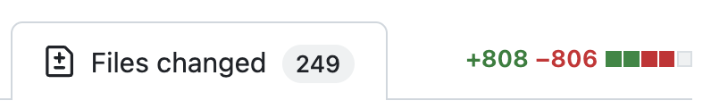

During a recent project of migrating a `create-react-app` code base to Next.js,
I faced an interesting challenge: I had to update Tailwind class names across 200+
React components.

The legacy code base used a [Material Design](https://m2.material.io/design/color/the-color-system.html)-based convention for naming classes.
This resulted in class names like `bg-primary-light` and `bg-primary-main`.
These class names had to be updated to a new color-specific class naming convention like `bg-blue-200` and `bg-blue-500`. Changing these by hand would be time consuming and 
tedious.

This post outlines the steps I took to update Tailwind class names across 200+
React components using custom Node.js scripts and a jscodeshift codemod. 

## Some Questions To Consider Before Getting Started

Using codemods to make large scale changes across your code base can be game
changing for your producivity. You can also shoot yourself in the foot. When
starting this project, I had to ask myself some important questions first:

- How many files need to be updated?
- Is it worth putting in the time it takes to write a codemod? 
- Will it be quicker to make the changes manually, even if doing so will be more tedious?
- How easy would it be for me to test that the codemod made the updates as intended? 
- How easy would it be to undo the changes?

This list is by no means exhaustive but it helps to highlight the
potential pitfalls that come up when using a powerful tool like jscodeshift.

For my specific use case, this was a complete rewrite of an existing application
that was months away from having any external users. The design of the
application was going to stay the way but the Tailwind classes that powered that
design were going to change. I had some success in the past with making large scale
changes in the legacy code base using codemods. It was early on in the project
so the testing of the changes would happen in real-time while porting over
features. Any mistakes made would only affect the few other engineers working on
the project.  While I knew it would take a few days to accomplish, I decided that the effort would be worth it. 

## Analyzing the Tailwind Config Files

The legacy `tailwind.config.js` was a CommonJS file that was configured with a 
Material Design-based convention for class naming:

```js
module.exports = {
  theme: {
    colors: {
      black: "#333",
      primary: {
        "light": "#fecdd3",
        "main": "#f43f5e",
        "dark": "#881337"
      },
      secondary: {
        "light": "#dbeafe",
        "main": "#3b82f6",
        "dark": "#1e3a8a"
      },
      // info, success, etc
    },
  },
  ...
}
```

While sufficient for most use cases, there were limitations that came with using
this naming convention. Need a color lighter than `primary-light`? Hello,
`primary-lighter`. 

The new application had a `tailwind.config.mjs` ESM file that 
provided a more comprehensive palette that you would typically see in a code
base that uses Tailwind:

```js
export default {
  theme: {
    colors: {
      black: "#333",
      red: {
        "50": "#fff1f2",
        "100": "#ffe4e6",
        "200": "#fecdd3", // primary.light
        "300": "#fda4af",
        "400": "#fb7185",
        "500": "#f43f5e", // primary.main
        "600": "#e11d48",
        "700": "#be123c",
        "800": "#9f1239",
        "900": "#881337"  // primary.dark
      },
      blue: {
        "50": "#eff6ff",
        "100": "#dbeafe", // secondary.light
        "200": "#bfdbfe",
        "300": "#93c5fd",
        "400": "#60a5fa",
        "500": "#3b82f6", // secondary.main
        "600": "#2563eb",
        "700": "#1d4ed8",
        "800": "#1e40af",
        "900": "#1e3a8a"  // secondary.dark
      },
      // info, success, etc,
    }
  }
}
```

We still have the same colors, but now we have more color options available to
us.

## Parsing the Tailwind Config Files

[jscodeshift](https://github.com/facebook/jscodeshift) is a library designed for writing "codemods". A codemod is an
automated script used to refactor or modify code at scale, often across large
code bases. It is commonly employed to update syntax, migrate libraries, or
implement consistent coding standards efficiently. In addition to transforming
the React components, I also used jscodeshift to help with mapping the values
from the two config files, and analyzing the React components before writing the
codemod itself.

The two configs had the same values but used different names. I needed a JSON
file that mapped the values from both configs into an object that I could use
with the codemod.

```json
{
  // old class name  : new class name
  'text-primary-main': 'text-red-500'
}
```

With two separate code bases in different directories, I placed a
`mapConfigs.mjs` script in a
new folder `tailwind-codemod` directory adjacent to them. I then created a new npm 
package and installed jscodeshift.

```
mkdir tailwind-codemod
cd tailwind-codemod
npm init -y
npm i jscodeshift@^0.15.2
vim mapConfigs.mjs
```

I used `jscodeshift@^0.15.2` when I originally wrote this script. When I tried
using the latest version for this post, I got some errors. So `0.15.2` it is.

My intent was to write a script that I can pass the paths of both code bases
as arguments. This script then outputs a JSON file into the `tailwind-codemod`
directory.

```
node mapConfigs.mjs --legacy ../old-repo/tailwind.config.js --updated ../new-repo/tailwind.config.mjs
```

The entire contents of `tailwind-codemod/mapConfigs.mjs` are below, commented to
explain its contents.

```js
import fs from "node:fs/promises";
import path from "node:path";
import * as url from "node:url";
import { parseArgs } from "node:util";
import j from "jscodeshift";

const __dirname = url.fileURLToPath(new URL(".", import.meta.url));

const {
  values: { legacy, updated },
} = parseArgs({
  options: {
    legacy: {
      type: "string",
    },
    updated: {
      type: "string",
    },
  },
});

/**
 * These objects will be used to look up the colors from each
 * config. As we parse the configs, we will add the key value
 * pairs used to create the Tailwind class names to each object.
 */
const legacyColors = {};
const newColors = {};

/**
 * Convert both tailwind config files into abstract syntax trees.
 */
const legacyAst = j(await fs.readFile(legacy, "utf8"));
const newAst = j(await fs.readFile(updated, "utf8"));

/**
 * Recursively parses the key / value pairs on an object node
 * path, updating the `colors` argument with the same structure as 
 * the Tailwind config.
 */
function parseAstObjectProperties(colors, nodePath) {
  if (nodePath.value.type === "Literal") {
    /**
     * The legacy config is using strings for keys and the new 
     * config has both strings and numbers for keys. When a key 
     * is a string, we can get the key using `nodePath.key.name`. 
     * A number is a literal, and the parsed key node path does 
     * not have a `nodePath.key.name`; it has `nodePath.key.value`.
     */
    colors[nodePath.key.name || nodePath.key.value] = nodePath.value.value;
  } else if (nodePath.value.type === "ObjectExpression") {
    /**
     * We have a key with a value that is an an object (such 
     * as `theme.colors.primary`) so let's create a new key on 
     * `colors` using the key. This allows us to capture the 
     * nested values, such as `light`, `main`, `dark`, etc.
     */
    colors[nodePath.key.name || nodePath.key.value] = {};

    for (const propertyPath of nodePath.value.properties) {
      parseAstObjectProperties(colors[nodePath.key.name], propertyPath);
    }
  }
}

/**
 * Looks for the "colors" key on the config's ast, and then 
 * grabs the key values from it, adding them to the provided 
 * `colors` argument.
 */
function getColorsFromAst(ast, colors) {
  ast
    .find(j.Property, {
      key: {
        name: "colors",
      },
    })
    .forEach((path) => {
      for (const propertyPath of path.value.value.properties) {
        parseAstObjectProperties(colors, propertyPath);
      }
    });
}

getColorsFromAst(legacyAst, legacyColors);
getColorsFromAst(newAst, newColors);

/**
 * Utilty function for parsing the tailwind config values 
 * into object key / value pairs, [['key', 'value']], in a 
 * recursive manner. The path of nested objects are used to 
 * create the key.
 *
 * This:
 *
 *  black: '#333',
 *  primary: {
 *    main: '#f43f5e',
 *  }
 *
 *  becomes this:
 *
 *  [
 *    ['black', '#333'],
 *    ['primary-main', '#f43f5e'],
 *  ]
 */
function getColorKeyValuePairs(input, classNamePrefix = "", output = []) {
  if (typeof input === "object") {
    for (const [key, value] of Object.entries(input)) {
      getColorKeyValuePairs(
        value,
        classNamePrefix === "" ? key : `${classNamePrefix}-${key}`,
        output,
      );
    }
  } else {
    output.push([classNamePrefix, input]);
  }

  return output;
}

const legacyKeyValuePairs = getColorKeyValuePairs(legacyColors);
const newColorKeyValuePairs = getColorKeyValuePairs(newColors);

/**
 * This is an array of tuples that have both the old and new values.
 * [[ 'primary-main', 'red-500']]
 */
const newClassNamePairs = [];

/**
 * Populate `newClassNamePairs` with the values from `legacyKeyValuePairs` 
 * and `newColorKeyValuePairs`.
 */
for (const [legacyPath, legacyValue] of legacyKeyValuePairs) {
  for (const [newPath, newValue] of newColorKeyValuePairs) {
    if (legacyValue.toLowerCase() === newValue.toLowerCase()) {
      newClassNamePairs.push([legacyPath, newPath]);
    }
  }
}

/**
 * Create a JSON file that maps legacy color values to their 
 * new values. This JSON file is only used to spot check our work.
 */
await fs.writeFile(
  path.join(__dirname, "tw-colors-map.json"),
  JSON.stringify(Object.fromEntries(newClassNamePairs.sort()), null, 2),
  "utf8",
);

/**
 * This will hold the class names tailwind automatically creates 
 * for us using the colors we provide it. So the `primary` color 
 * becomes `text-primary-main`, `bg-primary-main`, `border-primary-main`. 
 * We want to map the legacy colors to what their new class names 
 * will be, with the legacy class name as the key, and the updated 
 * class name as the value.
 *
 * { "text-primary-main": "text-red-100" }
 */
let newColorClassNames = {};
const twClassNamePrefixes = ["text", "bg", "border"];

/**
 * Loop over the Tailwind class name prefixes, building an object 
 * with our legacy class names mapped to their new classname.
 */
for (const classNamePrefix of twClassNamePrefixes) {
  newColorClassNames = {
    ...newColorClassNames,
    ...newClassNamePairs.reduce((memo, item) => {
      memo[`${classNamePrefix}-${item[0]}`] = `${classNamePrefix}-${item[1]}`;
      return memo;
    }, {}),
  };
}

/**
 * Create a JSON file with the old Tailwind class names mapped 
 * to their new class names. We will use this JSON file when doing 
 * the transform that will update our React components, replacing 
 * the old legacy names with the new ones.
 */
await fs.writeFile(
  path.join(__dirname, "tw-classes-map.json"),
  JSON.stringify(newColorClassNames, null, 2),
  "utf8",
);
```

A brief synopsis:

- get the config files from the script CLI arguments
- create a "look up" object that allows you to map the old class names with the
  new ones
- use jscodeshift to get the contents of `theme.colors` from those config files
- take the values from the "look up" objects and map them to two JSON files,
  `tw-classes-map.json` and `tw-colors-map.json`

In this code, the term "AST" is being used in a number of places. "AST" is an abbreviation for "abstract syntax tree". [Wikipedia defines an abstract syntax tree](https://en.wikipedia.org/wiki/Abstract_syntax_tree) as a "data structure used
in computer science to represent the structure of a program or code snippet."
jscodeshift turns the config files into JavaScript objects that represent
the code in those files, complete with methods that allowed me to modify the
contents. This is how a codemod work, by turning your JavaScript into JavaScript that you can use to rewrite your JavaScript. [AST Explorer](https://astexplorer.net) is a great tool for playing around with ASTs and codemods. 

The creation of `tw-colors-map.json` allowed me to easily spot check that `primary-main` 
was correctly mapped to `red-500`. `tw-classes-map.json` has the actual Tailwind generated classes that we want to migrate in the code base.

```js
// tw-colors-map.json
{
  "black": "black",
  "primary-dark": "red-900",
}

// tw-classes-map.json
{
  "text-black": "text-black",
  "bg-black": "text-black",
  "text-primary-main": "text-red-500"
  "bg-primary-main": "text-red-500"
}
```

### Adding a `legacy` Directory To The New Repo

As mentioned earlier, this work was part of a re-platforming project for an
existing web application. Directly copying the old code base into the `src`
directory of the new code base was not feasible. And applying the codemod to the 
still-active legacy code base was not an option as well.

To solve this, we established a dedicated `legacy` folder within the new
repository. This allowed us to selectively transfer significant portions of the
legacy code base as-needed. It also allowed for me to execute the codemod against
all of the files that would be eventually migrated over. Throughout the migration 
of features, the codemod eliminated one less concern from our checklist.

## Analyzing The Class Names

If all of our classes were written like this, writing our codemod would be pretty
straightforward:

```js
className="flex w-full flex-col items-end rounded-lg border border-primary-main"
```

But a good amount of them actually looked like this:

```js
className={cx(
  className,
  'flex w-full flex-col rounded-lg border border-primary-main'
)}
```

...and this:

```js
className={active ? 'active' : ''}
```

There are a lot of expressions used to style our React components. I used
jscodeshift to analyze the React components, generating a JSON and text
file to see all of the different iterations. These files helped to target the
specific use-cases that I needed to address when writing the codemod.

I created `tailwind-codemod/analyzeClassNames.mjs` to analyze the React
component's usage of the `className` prop.

```js
import fs from 'node:fs/promises';
import path from 'node:path';
import * as url from 'node:url';
import { parseArgs } from "node:util";
import parser from '@babel/parser';
import j from 'jscodeshift';

const __dirname = url.fileURLToPath(new URL('.', import.meta.url));

const {
  values: { dir },
} = parseArgs({
  options: {
    dir: {
      type: "string",
    },
  },
});

const classNameAnalysis = {};
let text = '';

/**
 * Recursively analyze the `className`s props for all of 
 * files that end with ".jsx" or ".tsx" in a directory. 
 * We want to see what kind of AST node types make up our
 * `className` attributes. `className="action"` is a `StringLiteral`
 * and `className={active ? 'active' : ''}` is a `ConditionalExpression`. 
 * Using jscodeshift, we want to see what AST node types are 
 * used to create our `className` attributes. This will update the 
 * `classNameAnalysis` object to the following format:
 *
 * {
 *   "ConditionalExpression": [ // AST node type
 *     "className={active ? 'active' : ''}
 *   ],
 *   "LogicalExpression": [
 *     "className={foo === 'foobar' && 'foo bar'}
 *   ]
 * }
 */
async function analyzeClassNames(sourcePath) {
  const stats = await fs.stat(sourcePath);
  const isSourcePathDir = stats.isDirectory();
  const files = isSourcePathDir ? await fs.readdir(sourcePath) : [sourcePath];

  for await (const fileName of files) {
    const filePath = isSourcePathDir
      ? path.join(sourcePath, fileName)
      : fileName;
    const stats = await fs.stat(filePath);

    const isDir = stats.isDirectory();

    if (isDir) {
      await analyzeClassNames(filePath);
    } else if (fileName.match(/(jsx|tsx)$/)) {
      const source = await fs.readFile(filePath, 'utf8');

      /**
       * Use jscodeshift to parse the file for the React 
       * component. Since we are parsing files that can 
       * have either JSX or TypeScript, we need to use the 
       * `@babel/parser` to help with parsing them.
       */
      const root = j(source, {
        parser: {
          parse: (code, options) =>
            parser.parse(code, {
              ...options,
              tokens: true,
              plugins: ['jsx', 'typescript'],
            }),
        },
      });

      /**
       * Using `j.JSXAttribute`, we can target the `className` 
       * prop on all React components.
       */
      root
        .find(j.JSXAttribute, {
          name: {
            name: 'className',
          },
        })
        .forEach((path) => {
          const { type } = path.value.value;

          /**
           * `StringLiteral` is for `className="foo"`.  * We 
           * know those exist so we'll skip * them in our analysis.
           */
          if (type === 'StringLiteral') {
            return;
          }

          if (!classNameAnalysis[type]) {
            classNameAnalysis[type] = [];
          }

          /**
           * A `JSXExpressionContainer` is used to embed expressions 
           * within JSX elements, like `className={isFoo ? 'foo' : 'bar baz'}`. 
           * This is what we want to analyze.
           */
          if (type === 'JSXExpressionContainer') {
            if (Array.isArray(classNameAnalysis[type])) {
              classNameAnalysis[type] = {};
            }

            const expressionType = path.node.value.expression.type;

            if (!classNameAnalysis[type][expressionType]) {
              classNameAnalysis[type][expressionType] = [];
            }

            const source = j(path.node).toSource();

            if (
              !classNameAnalysis[type][expressionType].find((item) => item === source)
            ) {
              classNameAnalysis[type][expressionType].push(source);
            }
          }
        });
    }
  }
}

await analyzeClassNames(dir);

/**
 * It can be helpful to see what the `className` attribute looks like in the file
 * itself. We can use the contents of our `classNameAnalysis` analysis object to
 * create a `.txt` file that is more human-readable, like this:
 *
 * className={cx(
 *   className,
 *   'flex w-full flex-col rounded-lg border border-primary-main'
 * )}
 *
 * className={active ? 'active' : ''}
 *
 */
for (const className of classNameAnalysis) {
  const data = classNameAnalysis[className];

  if (Array.isArray(data)) {
    for (const item of data) {
      text += `\n\n${item}`;
    }
  } else {
    for (const key of data) {
      for (const item of data[key]) {
        text += `\n\n${item}`;
      }
    }
  }
}

await fs.writeFile(
  path.join(__dirname, 'classNames-analysis.json'),
  JSON.stringify(classNameAnalysis, null, ' '),
  'utf8',
);

await fs.writeFile(
  path.join(__dirname, 'classNames-analysis.txt'),
  text,
  'utf8',
);
```

This script is grabbing the `className` attribute with jscodeshift's `JSXAttribute`, 
using the node path that represents the AST for `className`. Using the `type` of 
the node path, it can be determined what the node type for the `className` is, 
outputting that info into JSON and `.txt` format.

Running `node ./analyzeClassNames.mjs --dir ../new-repo/legacy` showed the different expressions
used for the `className` attribute in our codebase:

```
CallExpression
ConditionalExpression
LogicalExpression
TemplateLiteral
```

This is a truncated list. A mature code base could have more. For
this post, this list will suffice.

## Writing the Codemod

With this list, I wrote a `transform.mjs` codemod in `tailwind-codemod`:

```js
import classLookUp from "./tw-classes-map.json";

/**
 * Create a regular expression from all of the keys on the
 * look up object created to map the legacy classes with the
 * newer class names. Probably a more efficient way of doing
 * this. :)
 */
const classNamesRE = new RegExp(
  `\\b(?:${Object.keys(classLookUp).join("|")})\\b`,
  "g",
);

/**
 * Take a `value` from AST node path and check it for a legacy
 * class name. If there is a match, use the class look up to
 * swap the legacy class name with the updated class name.
 */
function matchClassName(value) {
  if (!value) {
    return false;
  }

  try {
    const matches = [];
    let newValue = value;
    let match;

    while ((match = classNamesRE.exec(value)) !== null) {
      matches.push(match[0]);
    }

    if (matches.length) {
      for (const match of matches) {
        newValue = value.replace(match, classLookUp[match]);
      }

      return newValue;
    }
  } catch (e) {
    console.log("error", e);
  }
}

/* Allow for parsing Typescript files. */
export const parser = "tsx";

/* This is the transform. */
export default (file, api) => {
  /**
   * Alias the jscodeshift API
   */
  const j = api.jscodeshift;

  /**
   * Parse the code into an AST
   */
  const root = j(file.source);

  /**
   * Find all JSX attributes that are `className` and then iterate
   * over them.
   */
  root
    .find(j.JSXAttribute, {
      name: {
        name: "className",
      },
    })
    .forEach((path) => {
      const { value } = path.value;

      /* className="text-primary-main bg-primary-light" */
      if (value.type === "StringLiteral") {
        const newValue = matchClassName(value.value);

        if (newValue) {
          value.value = newValue;
        }
      }

      /* className={ ... } */
      if (value.type === "JSXExpressionContainer") {
        switch (value.expression.type) {
          /* className={fn( ... )} */
          case "CallExpression":
            for (const arg of value.expression.arguments) {
              if (arg.type === "StringLiteral") {
                const newValue = matchClassName(arg.value);

                if (newValue) {
                  arg.value = newValue;
                }
              }

              /* className={cx("text-primary-main", {"bg-primary-dark": isActive})} */
              if (arg.type === "ObjectExpression") {
                for (const property of arg.properties) {
                  const newValue = matchClassName(property?.key?.value);

                  if (newValue) {
                    property.key.value = newValue;
                  }
                }
              }
            }
            break;

          /* className={isActive && "text-primary-dark"} */
          case "LogicalExpression":
            for (const side of [
              value.expression.left,
              value.expression.right,
            ]) {
              if (side.type === "StringLiteral") {
                const newValue = matchClassName(side.value);

                if (newValue) {
                  side.value = newValue;
                }
              }
            }
            break;

          /*  className={isActive ? "text-primary-light" : "text-primary-main"} */
          case "ConditionalExpression":
            if (value.expression.consequent.type === "StringLiteral") {
              const newValue = matchClassName(
                value.expression.consequent.value,
              );

              if (newValue) {
                value.expression.consequent.value = newValue;
              }
            }

            if (value.expression.alternate.type === "StringLiteral") {
              const newValue = matchClassName(value.expression.alternate.value);

              if (newValue) {
                value.expression.alternate.value = newValue;
              }
            }

            break;

          /* className={`${className} text-primary-dark`} */
          case "TemplateLiteral":
            for (const quasisValue of value.expression.quasis) {
              const newValue = matchClassName(quasisValue.value.raw);

              if (newValue) {
                quasisValue.value.raw = newValue;
              }
            }
            break;
        }
      }
    });

  /**
   * Use jscodeshift to update the contents of the file.
   */
  return root.toSource();
};
```

A brief synopsis of this script:

- import our mapping JSON and turn it into a regular expression that is used to
  search for the Material Design class names
- find all `className` attributes in a file's JSX
- update `className` attributes that match the type of `CallExpression`, `ConditionalExpression`, `LogicalExpression` or `TemplateLiteral` with the updated class names

The different `case` statements show how each AST node is accessed to make the
change. With `TemplateLiteral`, I made a change to
`expression.quasis.value.raw`. A `LogicalExpression` involved
checking for a class name match with either
`expression.consequent.value` or `alternate.value`. These are JS representations of the
React components that we are modifying as interpreted by the Babel parser. Other
parsers will generate different syntax.

## Running the Codemod

We run our codemod in "dry" mode (which will not make any changes) with the 
following command:

```
npx jscodeshift@0.15.2 -t ./transform.mjs ../new-repo/legacy -d
```

That will show the following output in your terminal:

```
Processing 1 files...
Spawning 1 workers...
Running in dry mode, no files will be written!
Sending 1 files to free worker...
All done.
Results:
0 errors
1 unmodified
0 skipped
0 ok
Time elapsed: 0.282seconds
```

When I was ready to run the transform, I experimented with only running it
against a single file. I followed this up with a single directory. This allowed
me to spot check my work as I worked on the codemod. If there was an issue, I
could undo the changes with Git and start over. Although I knew what type of
expressions I had to write my codemod for, there was edge cases I missed.
The codemod in this post does not cover all of the edge cases for the
4 types that are being targeted. 

Here is a [repo where you can run these scripts locally](https://github.com/spencercarnage/tailwind-material-design-code-mod). You can also check out
this [AST
Explorer that demonstrates the codemod above in action](https://astexplorer.net/#/gist/926b9f286475fda3b07f8e693b06084e/7142299e17e0164633b1d814c0f7daab6342dc04). In the 
bottom right hand pane, you can see the transformed results of the React
component in the top left hand pane.

## Conclusion

Running a similar codemod like this on our codebase resulted in 249 updated
React components.



I also wrote another codemod to migrate the usage of a custom `translate` function to
`react-i18next`'s `useTranslation`. Another small but tedious changes made
negligible with jscodeshift.

In the tech sector's current climate, engineers are being asked to do more with
less. Codemods are great tools to help with that. While it will take some time to
master them, you are picking up a new skill that will make you a force multiplier.
The next time you have to make an update that spans many files, look into
writing a codemod for making that change.
